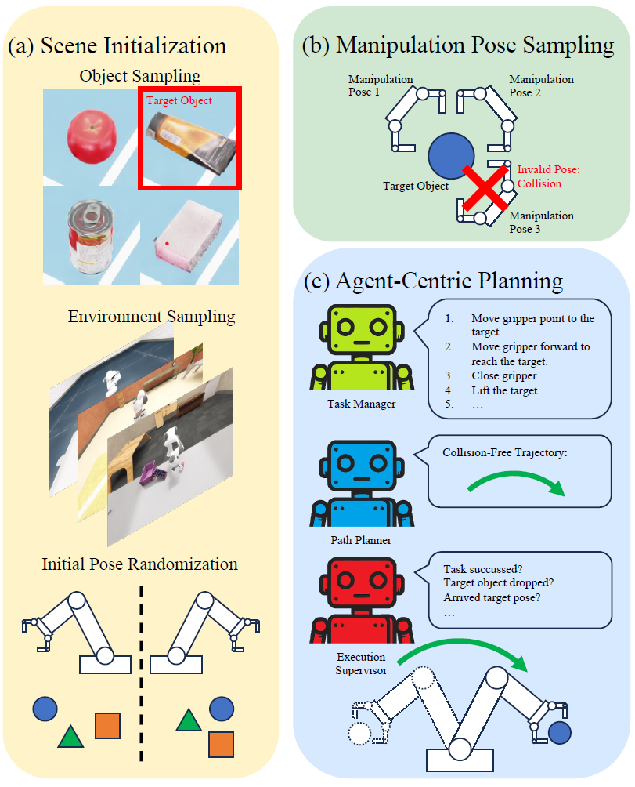

# Boosting Robotic Manipulation Generalization with Minimal Costly Data
[](https://arxiv.org/abs/2503.19516)
[](https://huggingface.co/datasets/zlm898/RoboTronCraft-v1)

## Introduction
The growing adoption of Vision-Language-Action (VLA) models in embodied AI intensifies the demand for diverse manipulation demonstrations.
However, high costs associated with data collection often result in insufficient data coverage across all scenarios, which limits the performance of the models. 
It is observed that the spatial reasoning phase (SRP) in large workspace dominates the failure cases. Fortunately, this data can be collected with low cost, underscoring the potential of leveraging inexpensive data to improve model performance. 
In this paper, we introduce the RoboTron-Craft, a  stage-divided and cost-effective pipeline for realistic manipulation generation. Base on this, the RoboTron-Platter method is introduced, a framework that decouples training trajectories into distinct task stages and leverages abundant easily collectible SRP data to enhance VLA model's generalization. 
Through analysis we demonstrate that sub-task-specific training with additional SRP data with proper proportion can act as a performance catalyst for robot manipulation, maximizing the utilization of costly physical interaction phase (PIP) data.
Experiments show that through introducing large proportion of cost-effective SRP trajectories into a limited set of PIP data, we can achieve a maximum improvement of 41\% on success rate in zero-shot scenes, while with the ability to transfer manipulation skill to novel targets.

Code comming soon.





## :white_check_mark: TODO List
- [ ] RoboTron-Craft data generation code
- [ ] RoboTron-Platter training & evaluation code
- [ ] Training dataset

## Citation
```bibtex
@article{zheng2025boosting,
  title={{Boosting Robotic Manipulation Generalization with Minimal Costly Data}},
  author={Liming Zheng, Feng Yan, Fanfan Liu, Yufeng Zhong, Chengjian Feng, Lin Ma},
  journal={arXiv preprint arXiv:2503.19516},
  year={2025}
}
```